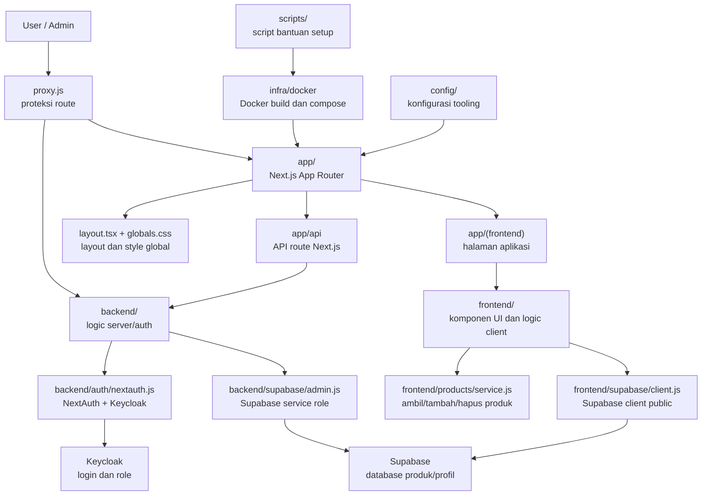
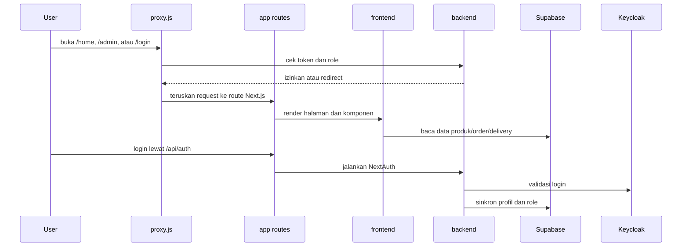

# Ilustrasi Struktur Project

Dokumen ini menjelaskan fungsi tiap komponen utama dalam project `online_market`.

## Gambaran Besar

## Alur Request

## Fungsi Folder Utama

| Lokasi | Fungsi |
| --- | --- |
| `app/` | Entry routing Next.js. Folder ini menentukan URL aplikasi seperti `/`, `/login`, `/home`, `/admin`, dan `/api/auth`. |
| `app/(frontend)/` | Route group untuk halaman frontend. Nama `(frontend)` tidak muncul di URL, hanya untuk merapikan struktur. |
| `app/api/` | API route yang harus tetap berada di dalam `app` agar dikenali Next.js. |
| `frontend/` | Kode yang dipakai tampilan: komponen UI, constants, product service, dan Supabase client public. |
| `backend/` | Kode server-side: konfigurasi NextAuth, routing auth, dan Supabase admin client. |
| `public/` | Asset statis yang bisa diakses browser. |
| `docs/` | Dokumentasi project, deployment, arsitektur, threat modeling, dan ringkasan implementasi. |
| `infra/docker/` | File Docker untuk build dan menjalankan aplikasi dengan Docker Compose. |
| `config/` | Konfigurasi tooling seperti ESLint. |
| `scripts/` | Script bantuan, misalnya instalasi Docker di WSL. |
| `.github/` | Workflow CI/CD GitHub Actions. |

## Detail Komponen Routing

| Route/File | URL | Fungsi |
| --- | --- | --- |
| `app/layout.tsx` | Semua halaman | Root layout, font, dan wrapper HTML utama. |
| `app/globals.css` | Semua halaman | Style global aplikasi. |
| `app/(frontend)/page.tsx` | `/` | Halaman root aplikasi. |
| `app/(frontend)/(auth)/login/page.jsx` | `/login` | Halaman login pengguna. |
| `app/(frontend)/(user)/home/page.jsx` | `/home` | Halaman belanja utama user. |
| `app/(frontend)/(user)/home/order_list/page.jsx` | `/home/order_list` | Daftar pesanan user. |
| `app/(frontend)/(user)/home/delivery/page.jsx` | `/home/delivery` | Tracking pengiriman. |
| `app/(frontend)/(admin)/admin/page.jsx` | `/admin` | Dashboard admin. |
| `app/(frontend)/(admin)/admin/products/page.jsx` | `/admin/products` | Kelola produk. |
| `app/(frontend)/(admin)/admin/products/add/page.jsx` | `/admin/products/add` | Tambah produk baru. |
| `app/api/auth/[...nextauth]/route.js` | `/api/auth/*` | Entry API NextAuth untuk login/logout/session. |
| `proxy.js` | Sebelum route tertentu | Cek akses user/admin dan redirect jika belum sesuai. |

## Detail Frontend

| Lokasi | Fungsi |
| --- | --- |
| `frontend/components/ui/` | Komponen tampilan yang dipakai ulang seperti header, nav bawah, kartu order, dan gambar produk. |
| `frontend/constants/` | Data statis untuk kategori market, order dummy, dan delivery dummy. |
| `frontend/products/service.js` | Fungsi akses produk: `getProducts`, `createProduct`, dan `deleteProduct`. |
| `frontend/products/utils.js` | Helper produk seperti format harga dan validasi payload form. |
| `frontend/supabase/client.js` | Supabase client dengan anon key untuk operasi dari sisi client. |

## Detail Backend

| Lokasi | Fungsi |
| --- | --- |
| `backend/auth/nextauth.js` | Konfigurasi NextAuth, provider Keycloak, callback JWT/session, dan sinkron profil ke Supabase. |
| `backend/auth/routing.js` | Logic proteksi route berdasarkan token dan role admin/user. |
| `backend/supabase/admin.js` | Supabase admin client memakai service role key. Hanya dipakai server-side. |

## File Root Yang Tetap Di Luar Folder

Beberapa file sengaja tetap di root karena dicari otomatis oleh tool:

| File | Alasan tetap di root |
| --- | --- |
| `package.json` | Dibaca npm untuk script dan dependency. |
| `package-lock.json` | Lock dependency npm. |
| `next.config.ts` | Konfigurasi Next.js. |
| `tsconfig.json` | Konfigurasi TypeScript dan path alias. |
| `postcss.config.mjs` | Konfigurasi PostCSS/Tailwind. |
| `next-env.d.ts` | Type declaration otomatis Next.js. |
| `proxy.js` | File proxy/middleware Next.js. |
| `.env.local` | Environment lokal yang dibaca Next.js. |
| `.gitignore` | Aturan file yang diabaikan Git. |
| `AGENTS.md` | Instruksi kerja agent di project ini. |
| `README.md` | Ringkasan utama repo. |

## Mental Model Singkat

- `app/` adalah pintu masuk URL.
- `frontend/` adalah isi tampilan dan interaksi pengguna.
- `backend/` adalah logic server yang tidak boleh terekspos langsung ke browser.
- `infra/`, `config/`, dan `scripts/` adalah alat bantu untuk build, deploy, dan development.
- File root adalah konfigurasi inti agar tool seperti Next.js, npm, Git, dan TypeScript bisa menemukan project dengan benar.
